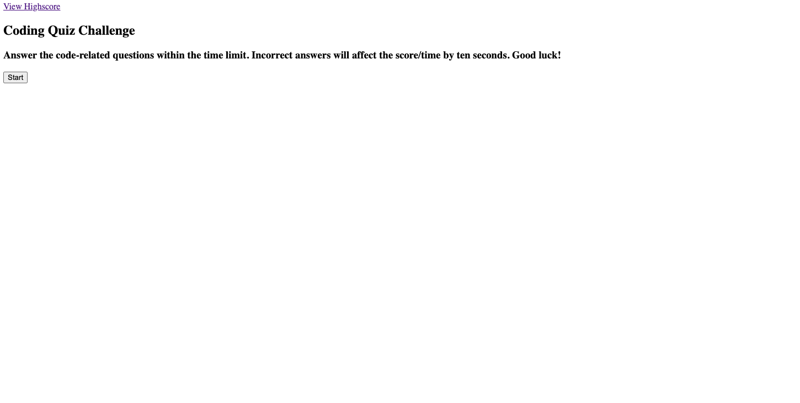

# JS-Quiz 

# Description 

I have created a webpage that (ideally) goes through a series of multiple choice questions with a timer going, and then tracks the score. 

- the timer will go down from 80, subtracting 10 seconds for each wrong answer 
- highscores can be tracked in the local storage and viewed permenantly 

As of writing this README, my webpage is not functioning. most of the code is written out but there's alot of errors when it is ran. I clearly have a lot to learn on utilizing javascript. Hopefully I can continue to work on it and get it running but as of the due date it is incomplete. 

# usage 
https://github.com/wburnton/JS-Quiz 

# License 

This project used a MIT License 
